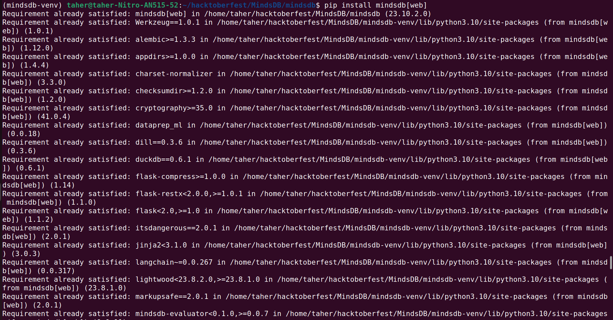
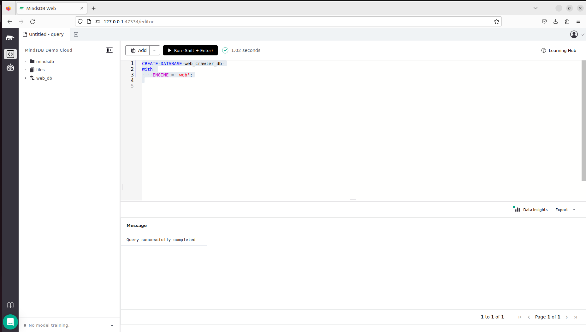
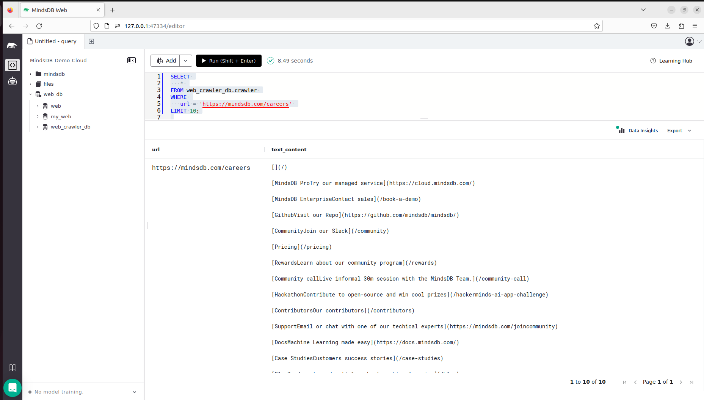
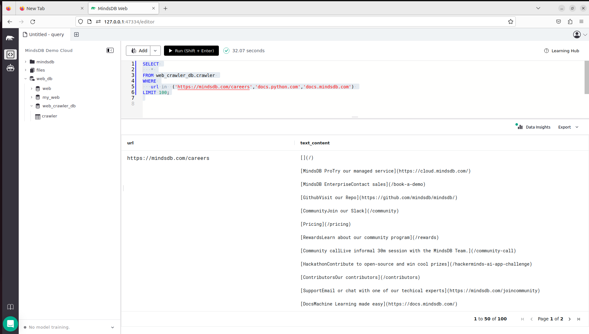

# Testing Web Crawler Integration

This README provides instructions for testing the Web Crawler integration in MindsDB.

For more details, refer to the related [GitHub Issue](https://github.com/mindsdb/mindsdb/issues/7896).

## Test Cases MindsDB Web Crawler
-----
### 1. Install MindsDB Web Crawler Locally via pip

**Screeshot Result: Successfully installed**

-----
### 2. Create Database Using Web Engine In MindsDB 

**Description:**
This creates a database called web_crawler_db. This database ships with a table called crawler that we can use to crawl data given some url/urls.

**Screeshot Result: Query successfully completed**

-----

### 3. Search for Web Content using the Crawler Table in Web Database

**Screeshot Result: Query successfully completed**

-----

### 4. Search for Contents on more than one Website using the Crawler Table in Web Database

**Screeshot Result: Query successfully completed**

-----

## Result

The Web Crawler integration has been successfully tested, and all test cases are working as expected.
